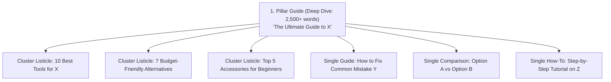

# Niche Content Strategist Skill

This skill turns any niche idea into a structured, high-ranking editorial roadmap using topical authority clustering (Hub-and-Spoke model).

## When to Use This Skill
- Launching a new blog in an unfamiliar or competitive niche
- Brainstorming high-intent article topics that convert and rank quickly
- Planning the next 10 to 30 articles for an existing blog
- Mapping out internal linking between Pillar guides and Cluster listicles

## Topic Clustering Framework

For any niche (e.g., *Ultralight Backpacking*, *Home Barista*, *SaaS Productivity*, *French Bulldog Care*), content is categorized into three balanced tiers:

## Strategy Workflow

When asked to create a content calendar:
1. **Analyze the Niche**:
   - Determine target audience demographics and primary pain points.
   - Identify commercial versus informational search intent.

2. **Produce the Master Editorial Table**:
   Output a table with:
   - **Week / Priority**
   - **Type**: `listicle` or `single_article`
   - **Working Title**: High-CTR, search-optimized title
   - **Target Primary Keyword** & Search Intent
   - **Monetization Angle**: (Affiliate picks, Display Ads, Lead Magnet, Sponsored)
   - **Antigravity Action Prompt**: Exact command you can give Antigravity to write it immediately.

3. **Produce the Internal Linking Map**:
   Define which articles link to each other to maximize PageRank distribution and Google crawl efficiency.

See [cluster_framework.md](./resources/cluster_framework.md) for full cluster blueprint templates.
